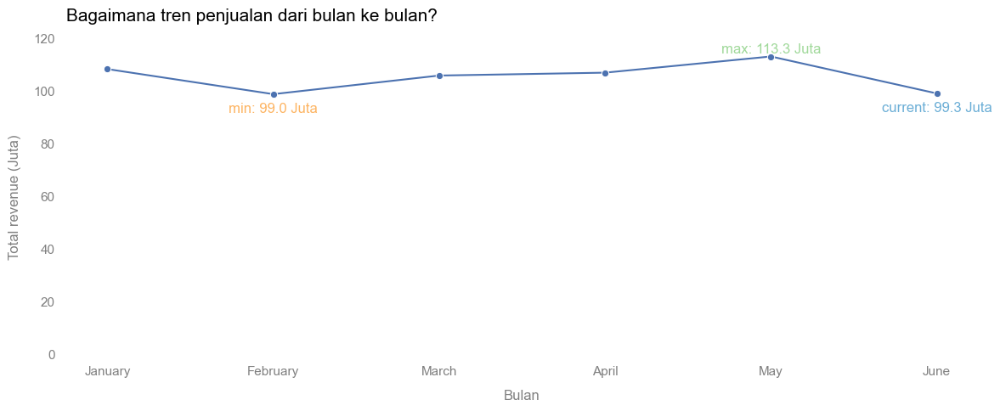
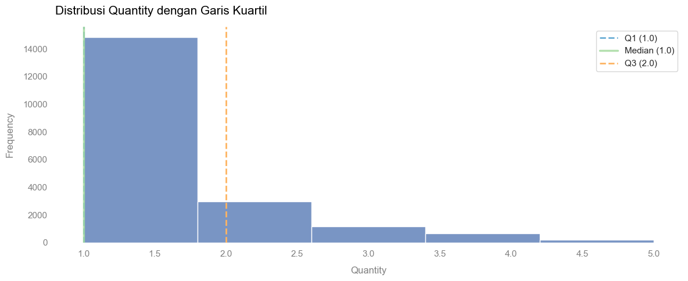
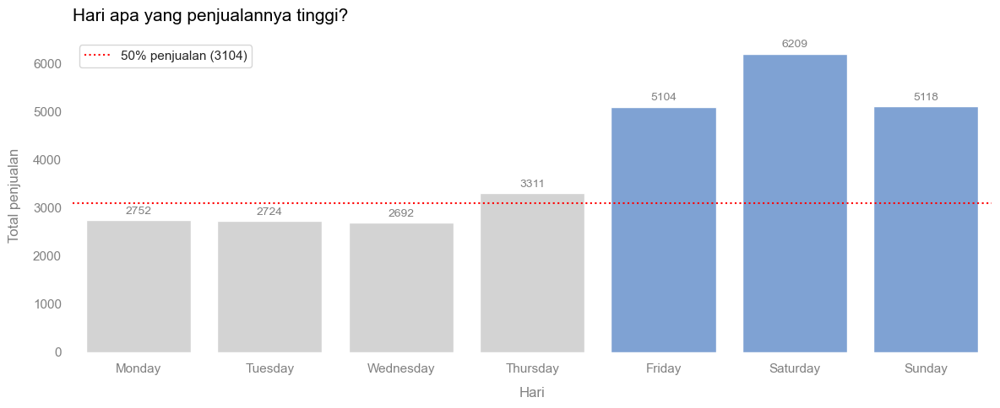
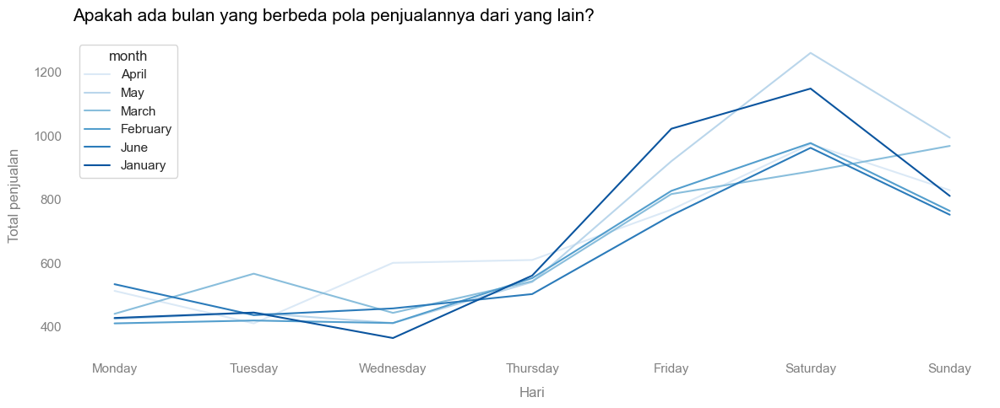
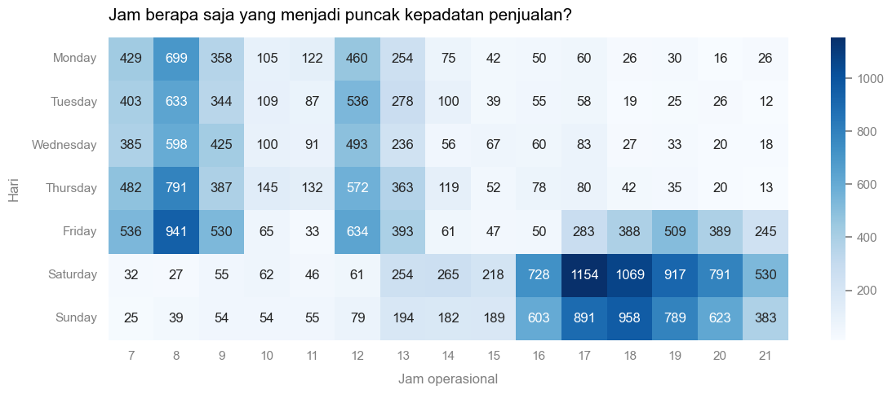

# ☕ Aroma Jaya Coffee Shop: Operational & Sales Optimization Analysis

[](https://www.python.org/)
[](https://pandas.pydata.org/)
[](https://seaborn.pydata.org/)
[](https://public.tableau.com/shared/NGC76SMC2?:display_count=n&:origin=viz_share_link)

## 📌 Business Scenario & Problem Statement
Owner Kedai Kopi **Aroma Jaya (Cabang Sudirman)** menghadapi anomali operasional yang serius: secara visual terjadi **antrean pelanggan yang sangat panjang**, namun **pendapatan bulanan stagnan**. Di sisi lain, manajemen mengalami kerugian akibat penumpukan stok bahan baku (*deadstock/spoilage*) akibat strategi penyediaan pasokan yang kurang tepat.

Proyek ini bertujuan untuk membedah data transaksi POS selama 6 bulan terakhir guna menjawab 3 pertanyaan kunci:
1. Bagaimana tren penjualan Aroma Jaya dari waktu ke waktu (bulanan)?
2. Hari apa saja dalam seminggu yang cenderung menghasilkan volume penjualan tertinggi?
3. Waktu/jam berapa saja yang menjadi puncak kepadatan transaksi (*peak hours*)?

---

## 🛠️ Data Cleaning & Tech Stack
Sebelum analisis dilakukan, dataset melalui tahap *data cleaning* intensif untuk menjamin validitas hasil:
* **Handling Missing Values:** Penanganan data kosong (*missing values*) pada kolom strategis.
* **Removing Duplicates:** Mengeliminasi data duplikat.
* **Inconsistent Text Fix:** Standarisasi teks dan perbaikan variasi penulisan input sistem.
* **Outlier Removal:** Pembersihan data *outlier* pada kolom kuantitas agar hasil agregat tidak bias.

*Tech Stack:* `pandas`, `matplotlib`, `seaborn`.

---

## 📊 Key Insights & Deep-Dive Visualizations

### 1. Tren Penjualan Bulanan & Analisis Nilai Struk (*Basket Size*)
Grafik pendapatan makro menunjukkan tren datar (*stagnant*) dengan fluktuasi tipis di bawah 5%, bergerak di rentang **Rp99 Juta hingga Rp113 Juta**.


Investigasi pada nilai belanja per transaksi menunjukkan rata-rata nominal struk sangat statis di angka **~Rp43.300 hingga ~Rp44.400**.



Berdasarkan analisis histogram di bawah, nilai Kuartil 1 (Q1) dan Median (Q2) berada tepat di angka **1.0 item**, sementara Kuartil 3 (Q3) berada di angka **2.0 item**.



> 💡 **Insight:** Sebanyak 75% transaksi pelanggan hanya membeli 1–2 item saja. Stagnansi omzet terjadi karena kecilnya ukuran keranjang belanja (*basket size*). Kasir terlihat sangat sibuk mengantre bukan karena lonjakan omzet besar, melainkan karena melayani ribuan transaksi kecil yang nilainya seragam.

---

### 2. Analisis Kunjungan Harian (*Normal vs Weekend Spike*)
Volume penjualan harian secara konsisten terbagi menjadi dua kategori yang kontras di setiap bulannya:
* **Senin–Kamis (Normal):** Penjualan stabil bermutu volume rendah (**~2.600 - ~3.300 item**).
* **Jumat–Minggu (Spike):** Penjualan melonjak **2x lipat** (**~5.100 - ~6.200 item**) dan menyumbang lebih dari 60% total transaksi mingguan.



Analisis tren harian antar-bulan mengonfirmasi bahwa pola ini berulang konstan setiap bulan tanpa adanya perubahan anomali musiman. Cabang Sudirman terbukti merupakan cabang berbasis *lifestyle & hangout*.



> 💡 **Insight:** Volume penjualan akhir pekan melonjak hingga 2x lipat dibandingkan hari biasa. Pola ini terbukti berulang konstan setiap bulan dari Januari hingga Juni tanpa ada anomali tren. Kebijakan menyamaratakan stok harian terbukti menjadi pemicu utama kerugian penumpukan bahan baku (deadstock) di hari Senin–Kamis.

---

### 3. Peta Jam Puncak Kunjungan (*Extreme Peak Hours*)
Kepadatan transaksi per jam menunjukkan konsistensi pola yang sangat tebal di sepanjang semester pertama tahun 2026:
* **Senin – Jumat:** Penumpukan pesanan terpusat pada jam berangkat kantor (**07.00–09.00**) dan istirahat makan siang (**12.00–13.00**).
* **Khusus Hari Jumat:** Terjadi gelombang keramaian susulan pada pukul **17.00–21.00**.
* **Sabtu & Minggu:** Pola bergeser ke waktu santai, mulai ramai sejak pukul 13.00 dan memuncak pada pukul **16.00–21.00**.



Visualisasi *Heatmap* di bawah menunjukkan stabilitas struktur jam sibuk yang konsisten mengalir dari bulan Januari hingga Juni:


> 💡 **Akar Masalah:** Antrean panjang bersifat semu secara finansial. Kapasitas operasional (mesin espresso, kecepatan barista, dan kasir) mengalami *overload* parah hanya pada jam-jam kritis tersebut, memicu tingginya angka pembatalan pesanan (*customer drop-off*). Sebaliknya, di luar jam tersebut kedai cenderung sepi dan aset operasional menganggur (*idle*).

---

## 🖥️ Interactive Sales Dashboard (Tableau)
Untuk melengkapi analisis operasional ini, dibangun sebuah dashboard interaktif menggunakan **Tableau Public** untuk memantau performa bisnis di tingkat makro secara berkala.

👉 **[Klik di sini untuk mengakses Tableau Dashboard Interaktif](https://public.tableau.com/shared/NGC76SMC2?:display_count=n&:origin=viz_share_link)**

---

## 💡 Actionable Recommendations
Rekomendasi taktis berbasis data yang diajukan kepada Owner Aroma Jaya adalah:

1. **Optimalisasi Stok & Manajemen Rantai Pasok:** Menurunkan suplai pasokan bahan baku sebesar **30–40% pada hari Senin–Kamis** untuk memotong biaya pembuangan stok (*waste*). Alihkan anggarannya untuk mempertebal pasokan menu cepat saji menjelang akhir pekan.
2. **Penjadwalan Staf Dinamis (*Dynamic Shifting*):** Hentikan kebijakan jumlah staf yang sama rata setiap hari. Jadwalkan kapasitas penuh tim (*Full Team*) khusus pada hari Jumat malam serta Sabtu–Minggu sore (pukul 16.00–21.00).
3. **Mengurai Antrean & Peningkatan *Basket Size*:**
   * Terapkan sistem *Pre-Order* mandiri via WhatsApp Otomatis atau QR Code di meja khusus untuk pesanan *Takeaway* di jam sibuk guna memecah *bottleneck* kasir.
   * Edukasi staf kasir untuk melakukan *cross-selling* produk camilan (Croissant/Roti Bakar) lewat paket *bundling* cepat saat melayani pembelian single-item, dengan target menaikkan rata-rata nilai struk ke angka Rp60.000-an dalam 3 bulan.

---

## 📁 Repository Structure
```text
├── dataset/
│   ├── dataset_pos_aromajaya.csv      # Dataset mentah sebelum dibersihkan
│   └── cleaned_data.csv               # Dataset sesudah dibersihkan
├── notebooks/
│   ├── data_preparation.ipynb          # Notebook proses Data Cleaning
│   └── eda.ipynb                      # Notebook proses EDA & Visualisasi
├── reports/
│   └── laporan_analisis_operasional.pdf # Laporan bisnis final (PDF)
└── README.md                          # Ringkasan proyek (Dokumen ini)
